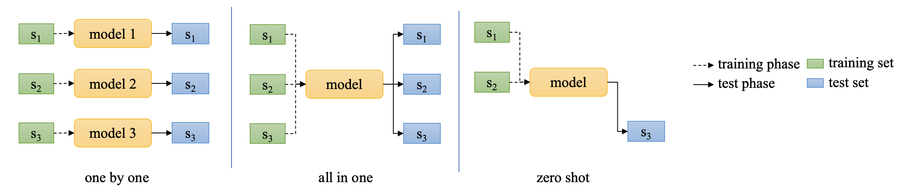

# Introduction
EasyTSAD is a suite to facilitate the quick implementation and iteration of your ***time series anomaly detection algorithms***. You can also easily develop a new set of ***evaluation metrics*** based on this suite and assess them against baseline methods. 

We offer several training schemas to provide more practical perspectives for TSAD. The schemas are illustrated as follows:
 

We welcome you to send the algorithm code implemented based on this suite to our email. We will integrate your method into the algorithm library, making it convenient for researchers and practitioners to utilize your approach or evaluation protocol.

# Features
### For Algorithm Researches
- Flexible interface for algorithm implementation, training and testing new algorithms on one-by-one, all-in-one and zero-shot training schemas.
- Full pipeline for load dataset, run experiments, do evaluations and analysis(e.g. plots and compares anomaly scores, or generate CSVs for intuitional comparison) the performance of methods.
- Diversity evaluation protocols for preformance evaluations.

### For Evaluation Researches
- Flexible interface for evaluation protocol implementation based on anomaly scores and ground truth labels.
- Easily perform evaluations on existing methods according to your protocol. 
- Evaluation based on offline scores of methods, which generated by merely once training and test phase.

### For Practitioners of Community or Enterprise
- Unified and clear Datasets format, easy for introduction of private datasets.
- Easy performance comparison of baselines on your dataset. E.g. *Overall performance in CSV format* based on protocols suitable for your applications; *Plots of all methods* on specify curves.
- Record runtime statistics (e.g. model parameter size, inference time) for performance, cost, and efficiency trade-off.
- An Evaluation protocol designed for real-time AD scenarios (EasyTSAD.Evaluations.Protocols.EventF1PA, for details please refer to our paper).

### Leaderboard Representation
- We provide a continuous integrated leaderboard (https://adeval.cstcloud.cn/content/home) based on this suite and make it vivid to show state-of-the-art algorithms rankings based on various training schemas and evaluation protocols. 
- ***Welcome to provide us your algorithms or evaluation criterion based on this suite by e-mails.*** We will add it into the leaderboard after checking, running, and obtaining your permission.
 
# Get Started

## Installation

### Prerequisites (environment manager like conda, pipenv or poetry is recommended)
- python >= 3.9, < 3.13

### Using `pip` to install the suite from Pypi
```
pip install EasyTSAD
```
The documentation of EasyTSAD is hosted at https://dawnvince.github.io/EasyTSAD/.

### Additonal Dependencies
Some built-in algorithms are based on Pytorch 2.0 or Pytorch-lightning 2.0. You may need to install related packages (including but not limited to pytorch, pytorch-lightning, torchinfo, torch_optimizer) if you want to run the baselines.

## Prepare datasets

### Use default datasets
Original datasets can be downloaded from https://wait-to-be-published. 
The directory structure of the dataset is shown as follows:
```
datasets
└── UTS
    ├── dataset_1
    │   ├── time_series_1
    │   │   ├── train.npy (training set, 1-D ndarray, necessary)
    │   │   ├── test.npy (test set, 1-D ndarray, necessary)
    │   │   ├── train_label.npy (labels of training set, 1-D ndarray, neccessary)
    │   │   ├── test_label.npy (labels of test set, 1-D ndarray, necessary)
    │   │   ├── train_timestamp.npy (timestamps of training set, 1-D ndarray, optional)
    │   │   ├── test_timestamp.npy (timestamps of test set, 1-D ndarray, optional)
    │   │   └── info.json (some additonal information, json, optional)
    │   │
    │   ├── time_series_2
    │   └── ...
    │
    ├── dataset_2
    └── ...
        

```
The file `info.json` contains the information like:
```json
{
    "intervals": 300,
    "training set anomaly ratio": 0.00148,
    "testset anomaly ratio": 0.00808,
    "total anomaly ratio": 0.00478
}
```

### Add your datasets
Preprocess your dataset to satisfy the above structure and format. Files labeled "necessary" must be offered. Then put it under the `datasets/UTS/` path. 


# Usage
Examples of how to use the suite can be find [here](https://github.com/dawnvince/EasyTSAD/tree/main/Examples), including:
- run baselines with/without customized config files;
- implement your new algorithm with/without config files;
- implement your new evaluation protocol and evaluate the baselines;
- generate CSV including the overall performance of all trained methods;
- aggregate all methods' anomaly scores into one plot.

Also, you can refer to the documentation hosted at https://dawnvince.github.io/EasyTSAD/.

## An example that implements a new method.

### Prepare a global config toml file. If not provided, the [default configuration](https://github.com/dawnvince/EasyTSAD/blob/main/EasyTSAD/Controller/GlobalCfg.toml) will be applied:
```toml
# One example of GlobalCfg.toml. 
# For more details please refer to the default configuration.
# The new items will overwrite the default ones.
[DatasetSetting]
 train_proportion = 1 # Using the last x% of the training set as the new training set. 1 means use the full training set.
 valid_proportion = 0.2 # The proportion of the validation set to the new training set.
```

### Define the Controller
```python
from typing import Dict
import numpy as np
from EasyTSAD.Controller import TSADController

# if cfg_path is None, using default configuration
gctrl = TSADController(cfg_path="/path/to/GlobalCfg.toml")
```

### Load Dataset configurations
#### Option 1: Load certain time series in one dataset:
```python
# Specify certain curves in one dataset, 
# e.g. AIOPS 0efb375b-b902-3661-ab23-9a0bb799f4e3 and ab216663-dcc2-3a24-b1ee-2c3e550e06c9
gctrl.set_dataset(
    dataset_type="UTS",
    dirname="/path/to/datasets", # The path to the parent directory of "UTS"
    datasets="AIOPS",
    specify_curves=True,
    curve_names=[
        "0efb375b-b902-3661-ab23-9a0bb799f4e3",
        "ab216663-dcc2-3a24-b1ee-2c3e550e06c9"
    ]
)
```

#### Option 2: Load all time series in certain datasets:
```python
# Use all curves in datasets:
datasets = ["AIOPS", "Yahoo"]
gctrl.set_dataset(
    dataset_type="UTS",
    dirname="/path/to/datasets", # The path to the parent directory of "UTS"
    datasets=datasets,
)
```

### Implement your algorithm (inherit from class BaseMethod):
The following class `YourAlgo` just provides a *skeleton*, where you should implement several functions. 
- The [Spot](https://github.com/dawnvince/EasyTSAD/blob/main/EasyTSAD/Methods/Spot/Spot.py) instance will help you understand how to implement a statistic model;
- The [ARLinear](https://github.com/dawnvince/EasyTSAD/blob/main/EasyTSAD/Methods/AR/AR.py) instance will help you understand how to implement a learning-based model (Implemented using PyTorch);

```python
from EasyTSAD.Methods import BaseMethod
from EasyTSAD.DataFactory import TSData

class YourAlgo(BaseMethod):
    def __init__(self, hparams) -> None:
        super().__init__()
        self.__anomaly_score = None
        self.param_1 = hparams["param_1"]
    
    def train_valid_phase(self, tsTrain: TSData):
        ...
        
    def test_phase(self, tsData: TSData):
        result = ... 
        self.__anomaly_score = result

    def train_valid_phase_all_in_one(self, tsTrains: Dict[str, TSData]):
        # used for all-in-one and zero-shot mode
        ...

    def anomaly_score(self) -> np.ndarray:
        return self.__anomaly_score

    def param_statistic(self, save_file):
        pass

```

### Do Experiments for your algorithm
We offer two options for algorithm setting configuration: 
- use config file;
- specify the parameters in functions. 

***Note:*** Parameters defined within a function take **higher** priority than those specified in the configuration file.

#### Option 1: Use config file for methods (Recommended) 
- Prepare a toml file, which is a subset of [Example.toml](https://github.com/dawnvince/EasyTSAD/blob/main/Examples/run_your_algo/YourAlgo.toml), for example:
```toml
# YourAlgo.toml
[Data_Params]
 preprocess = "z-score" 
[Model_Params.Default]
 param_1 = false
```

- Load YourAlgo and the config file:
```python
training_schema = "one_by_one"
method = "YourAlgo"  # string of your algo class

# run models
gctrl.run_exps(
    method=method,
    training_schema=training_schema,
    cfg_path="path/to/YourAlgo.toml"
)
```

#### Option 2: Specify the parameters in functions
```python
gctrl.run_exps(
    method=method,
    training_schema=training_schema,
    hparams={
        "param_1": False,
    },
    preprocess="z-score", 
)
```

The Score Results can be founded in path `workspace/Results/Scores`, and the runtime information can be founded in path `workspace/Results/RunTime`

### Perform evaluations (Based on the saved scores)
```python
from EasyTSAD.Evaluations.Protocols import EventF1PA, PointF1PA
# Specifying evaluation protocols
gctrl.set_evals(
    [
        PointF1PA(),
        EventF1PA(),
        EventF1PA(mode="squeeze")
    ]
)

gctrl.do_evals(
    method=method,
    training_schema=training_schema
)

```

The Evaluation Results can be founded in path `workspace/Results/Evals`

### Plot the anomaly scores for each time series
```python
gctrl.plots(
    method=method,
    training_schema=training_schema
)
```

The Plot Results can be founded in path `workspace/Results/Plots/score_only`


# Citation
todo